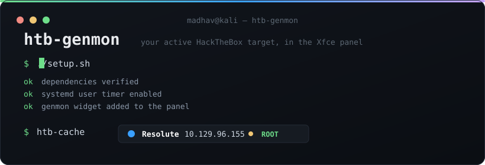

<div align="center">



<br>

**Your active HackTheBox machine, live in the Xfce panel.**


<br><br>



</div>

<br>

## What it does

`htb-king` already tells you which machine you have spawned. This puts that in your
panel so you stop typing it, and colours it so you can read it at a glance:

- **OS glyph** takes the colour of the platform. Windows blue, Linux amber, Ubuntu orange, Debian red.
- **Difficulty dot** goes green, amber, red or purple for Easy through Insane.
- **Progress badge** reads `OPEN`, `USER` or `ROOT` as you work through the box.
- **Click** copies the IP to your clipboard.
- **Hover** shows the full breakdown: OS, difficulty, points, both pwn flags.

The panel never calls the HTB API directly. A background timer refreshes a cache file
and the widget just reads it, so a slow VPN or a slow API never freezes your panel.

<br>

## Install

```bash
git clone https://github.com/Madhav-Sai/htb-genmon.git
cd htb-genmon
./setup.sh
```

That checks dependencies, installs the script, enables a systemd user timer, adds the
Generic Monitor widget to your panel and configures it. If it cannot reach the panel it
prints the manual steps instead.

Refresh interval defaults to 120 seconds. Change it:

```bash
INTERVAL=60 ./setup.sh
```

Skip the automatic panel setup:

```bash
NO_PANEL=1 ./setup.sh
```

### Requirements

| | |
|---|---|
| `htb-king` | must be on your PATH, or set `HTB_BIN` in the config |
| `xfce4-genmon-plugin` | `sudo apt install xfce4-genmon-plugin` |
| `xclip` | optional, needed for click-to-copy |
| A Nerd Font | needed for the OS glyphs, otherwise you get boxes |

<br>

## Configuration

Everything lives in `~/.config/htb-genmon/config`. It is sourced as shell, so it is
just variables. Edit it and run `htb-cache` to see the change immediately.

```sh
HTB_NERD_FONT="JetBrainsMono Nerd Font"

HTB_SHOW_IP=1
HTB_SHOW_DIFFICULTY=1
HTB_SHOW_STATUS=1
HTB_GAP="   "          # wider gaps: add spaces

COLOR_NAME="#ffffff"
COLOR_IP="#cfd8e3"
COLOR_WINDOWS="#3aa0ff"
COLOR_LINUX="#f5c542"
```

Palette presets for Nord, Gruvbox, Catppuccin and Tokyo Night are listed as comments at
the bottom of the config file.

<br>

## How it works

```
systemd timer  ->  htb-cache  ->  ~/.cache/htb-genmon/status  ->  genmon widget
   every 120s      calls the API      Pango markup                 reads every 10s
```

`htb-cache` strips ANSI colour from `htb-king -a`, splits the trailing Nerd Font glyph
off the machine name, maps its Unicode codepoint to an OS colour, and emits genmon's
`<txt>` / `<tool>` / `<click>` markup. Output is written to a temp file and moved into
place, so the widget never reads a half-written file.

Two details that are easy to get wrong and are handled here: the codepoint is read
byte-wise because `od -tx4` byte-swaps on little-endian hosts, and machine names are
XML-escaped before they reach Pango so an `&` in a name cannot break the markup.

<br>

## Troubleshooting

**Panel shows raw `<span>` tags.** Your genmon build is not parsing Pango markup.
Check `xfce4-panel --version`.

**OS glyph is a coloured tile or an empty box.** Pango is falling back to an emoji font.
Set the widget font to a Nerd Font, and make sure `HTB_NERD_FONT` matches the family
name exactly:

```bash
fc-list : family | grep -i nerd
```

**Panel is blank after a reboot.** The first timer run has not fired yet. Force it:

```bash
systemctl --user start htb-genmon.service
```

**Clicking does nothing.** Install `xclip`.

**Nothing updates.** Check the timer and run the script by hand to see the error:

```bash
systemctl --user status htb-genmon.timer
htb-cache && cat ~/.cache/htb-genmon/status
```

<br>

## Uninstall

```bash
./uninstall.sh
```

Removes the script, timer and cache. Asks before deleting your config. Remove the
Generic Monitor widget from the panel yourself.

<br>

## Layout

```
htb-genmon/
├── bin/htb-cache            the script that renders the widget
├── systemd/                 user service and timer templates
├── assets/                  animated SVGs used in this README
├── config.example           default configuration
├── setup.sh                 installer
└── uninstall.sh
```

<br>

## License

MIT. See [LICENSE](LICENSE).

<br>

<div align="center">
<sub>Built by <a href="https://pentestnotes.tech">Madhav</a> · <a href="https://app.hackthebox.com/profile/844410">HackTheBox</a> · <a href="https://tryhackme.com/p/Madhavsai">TryHackMe</a></sub>
</div>
